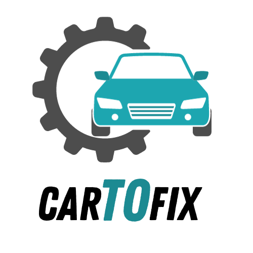

<!-- 

<b style="Font-size:32px">CarToFix</b>

 -->

<b style="Font-size:32px">CarToFix</b>
 

The purpose of this project is to make a webpage for workshops for helping them to have knowledge of all the work that has been and its going to be done.
 

## Why would you use CarToFix

CarToFix its a webpage that will help with the management of your workshop

With CarToFix you are able to register as many vehicles as you want, as well as their owners, then you can create budgets with one or more services, when creating a budget you have the option to send it by email and wait for the confirmation to start working, or if the client alredy said that its confirmed you can confirm and start working on it, when the work is done, the system will automaticaly send a confirmation email to the client telling them that the vehicle is ready to pick up, you can also edit or delete budgets.

## Installation

The project runs on an AWS EC2 server, you just need to conect to the webpage and start working on your workshop

### **You can try it here!** (link)

## Example of use

## Authors

